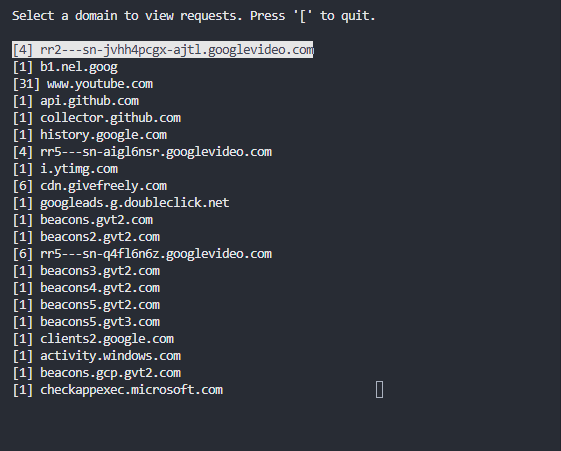
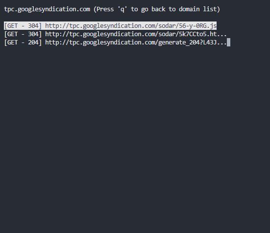
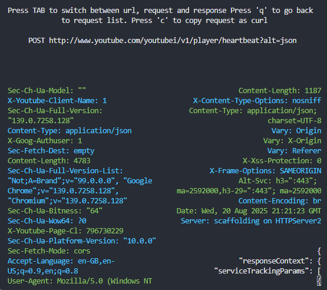
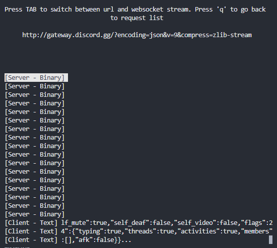

# mitm-proxy
A command line proxy used to inspect HTTP/HTTPS and WebSocket traffic. MITM is used to inspect TLS traffic through creating fake site certificates on the fly.

## Get started
Since we are spoofing TLS certificates dynamically we need the local machine to trust our certificates. This can be done through installing a Root Certificate Authority (RootCA) certificate into the system's trusted certificate store.
Navigate to `http://cert` in a browser to download the certificate. On windows, simply double click the certificate after it has been downloaded and install it in the `Trusted Root Certification Authorities` store. After installation, you may need to restart the proxy. You should now be able to proxy HTTPS traffic. 

### Showcase
> List of domains

> Traffic from selected domain

> Inspecting a request

> Inspecting a websocket stream

### TODO
1) Add support for proxying HTTP/2 traffic.
2) Add functionality for exporting requests with the .HAR format.
